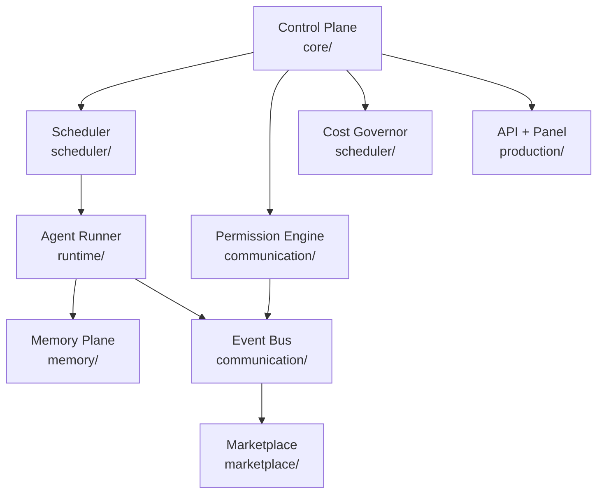

# HyperCore AI

Hipervisor para agentes de IA — infraestructura, no framework de prompts.

## Arquitectura (vista rápida)



## Estructura
```
core/            Agent DNA + máquina de estados + BIOS
runtime/         Runner serverless + Reconciliation Loop
scheduler/       Cost Governor (2 fases) + Scheduler (afinidad/prioridad)
memory/          Working/Episodic/Semantic + hash-chain
communication/   Permission Engine + Event Bus + comunicación auditada
marketplace/     Catálogo de Agent Images + Shadow Execution
enterprise/      8 mejoras opcionales (DAG, Chaos, ABAC, Knowledge Graph...)
database/        Persistencia real: SQLite (dev) y Postgres+NATS (prod)
production/      API pública + Panel Web + servidor con drivers reales
docs/            Documento completo de arquitectura + roadmap
examples/        Ejemplos ejecutables
tests/           Suite completa (5/5)
```

## Quickstart
```bash
python3 run_all_tests.py                              # 5/5 suites
PYTHONPATH=core:runtime:scheduler:memory:communication python3 examples/two_agents_collab.py
cd production && python3 main_v2.py                    # API en :8080
```

## Despliegue con infraestructura real
```bash
cp .env.example .env && pip install -r requirements.txt
docker compose up -d
python3 production/main_prod.py   # Postgres + NATS reales
```

## Calidad
```bash
python3 benchmark.py   # throughput medido de operaciones críticas
```
Ver `ARCHITECTURE_INDEX.md` (mapeo diseño↔código) y `CHANGELOG.md`.

## Estado — v0.1.0-alpha
Prototipo funcional probado end-to-end. No apto para datos reales de clientes
hasta cubrir lo listado en `docs/roadmap-enterprise.md` (cifrado, atestación, HA).
